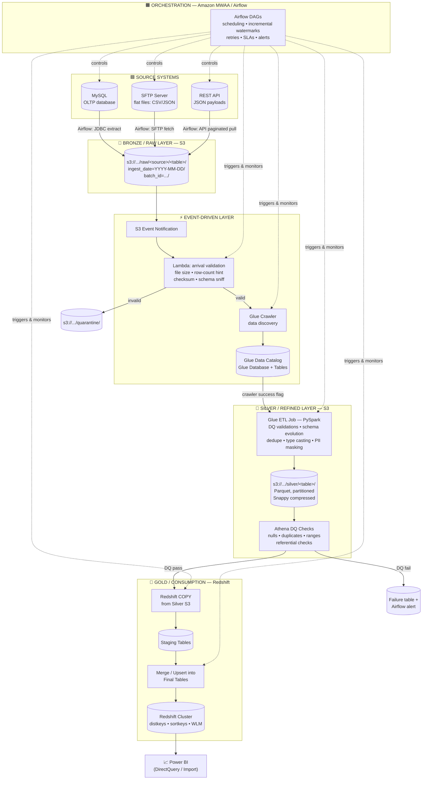

# 📊 Data Engineering Platform — LINEAGE & ARCHITECTURE TRACKER

> **This is the single source of truth for the pipeline.** Every component, data flow,
> idempotency rule, retry strategy, and optimization decision is tracked here.
> Update this file whenever a change is made to the pipeline.

| Field | Value |
|---|---|
| Project | `data-engineering-platform` |
| Repository | https://github.com/JayantVerman/data-engineering-platform |
| Cloud | AWS |
| Orchestrator | Apache Airflow (central orchestration) |
| Sources | MySQL, SFTP, REST API |
| Storage | S3 (Medallion: Bronze/Raw → Silver/Refined → Redshift/Gold) |
| Transformation | AWS Glue (PySpark) |
| Catalog | AWS Glue Data Catalog (via Glue Crawlers) |
| Validation | Lambda (arrival validation) + Athena (silver-layer DQ checks) |
| Warehouse | Amazon Redshift (COPY → staging → optimized insert/merge) |
| BI / Consumers | Power BI |
| Daily Volume | 30–50 GB/day (designed headroom: 100 GB/day) |
| Load Pattern | Incremental (watermark/CDC based), idempotent, retry-safe |

---

## 1. HIGH-LEVEL ARCHITECTURE (FLOWCHART)



---

## 2. STAGE-BY-STAGE DATA FLOW (DETAILED LINEAGE)

### Stage 0 — Source Systems
| # | Source | Type | Extraction Method | Incremental Strategy |
|---|--------|------|-------------------|----------------------|
| 1 | MySQL | Relational (OLTP) | Airflow operator (JDBC), chunked by PK ranges | High-watermark on `updated_at` / binlog-style CDC key |
| 2 | SFTP | Flat files (CSV/JSON) | Airflow SFTP fetch → S3 | Filename pattern + file-modified timestamp ledger |
| 3 | REST API | JSON (paginated) | Airflow HTTP operator with pagination loop | `since`/`cursor` parameter persisted per run |

**Rules**
- Every extraction records a **watermark** (last successful value) in Airflow Variables/XCom or a control table.
- Every landing writes a **manifest file** (`_MANIFEST.json`) with: batch_id, source, row_count, checksum (MD5/SHA256), watermark used, arrival timestamp.
- Extraction is chunked/streamed — never load full 50 GB into memory.

### Stage 1 — Bronze / Raw Layer (S3)
**Purpose:** immutable, as-is landing zone. No transformation, no deletion. Replayable.

**S3 layout (bucket: `<env>-dep-raw`):**
```
s3://{env}-dep-raw/
  └── {source_name}/                  # mysql | sftp | rest_api
      └── {table_or_entity}/
          └── ingest_date=YYYY-MM-DD/
              └── batch_id={uuid}/
                  ├── part-0000.{csv|json|parquet}
                  └── _MANIFEST.json
```

**Rules**
- **Immutability:** raw data is never edited or deleted (lifecycle → Glacier after N days).
- **Partitioning:** `ingest_date` (arrival date) — enables incremental processing and cost-efficient scans.
- Every batch carries a globally unique `batch_id` — the key to idempotency downstream.
- Size files at **128–512 MB** where possible (optimal for Spark/S3 list performance).

### Stage 2 — Event-Driven Validation (S3 Event → Lambda)
**Trigger:** S3 Event Notification (`s3:ObjectCreated:*`) filtered to `raw/*/_MANIFEST.json`
(so Lambda fires **once per batch**, not per file part).

**Lambda responsibilities (basic validation gate):**
1. Parse `_MANIFEST.json` → verify checksum of part files, non-zero row count.
2. Sniff file header/schema (columns present, delimiter, encoding).
3. Check record count vs. manifest `row_count` (tolerance ±0).
4. **Pass** → start Glue Crawler for that raw path (via boto3 `start_crawler`).
5. **Fail** → move batch to `s3://{env}-dep-quarantine/` + emit CloudWatch alarm + SNS alert.

**Idempotency note:** Lambda checks a DynamoDB control table `batch_registry`
(key: batch_id) — if batch already validated/processed, it exits without re-triggering.

### Stage 3 — Data Discovery (Glue Crawler → Data Catalog)
- Crawler targets the specific raw prefix of the validated batch.
- Creates/updates **Glue Database** `raw_db` and table metadata (schema, SerDe, partitions).
- Crawler configured to **merge new partitions** and not re-crawl unchanged schemas (`crawl` policy: crawl new folders only).
- On crawler **`SUCCEEDED`** state → Airflow sensor proceeds → Glue ETL job is triggered.
- On `FAILED` → alert, no downstream run.

### Stage 4 — Transformation (Glue ETL Job → Silver Layer)
**Purpose:** clean, conform, deduplicate, evolve schema — one job per entity family.

**Processing steps (PySpark, on Glue):**
1. **Read** from Catalog table, partition-pruned to the batch's `ingest_date`/`batch_id` (never re-read all history).
2. **DQ validations** — null checks on mandatory columns, regex/format checks, referential checks, value-range bounds. Bad rows → `s3://.../silver_rejects/` with reason column.
3. **Deduplicate** — `dropDuplicates` / `Window.row_number()` keyed on business key ordered by `updated_at desc` (latest wins).
4. **Schema evolution** — compare incoming schema vs. Catalog target:
   - New columns → **additive evolution** (allowed; null-filled for old records).
   - Type widening (int→long, float→double) → allowed.
   - Type narrowing / renames / drops → **blocked**, raises alert (backward-incompatible).
5. **Standardize** — timestamps to UTC, casing rules, currency normalization, PII masking (sha256/tokenize).
6. **Write** — **Parquet, Snappy compression**, partitioned by business date, in `s3://{env}-dep-silver/{table}/`.

**Optimizations applied at this stage**
- Push-down filters & column pruning on read; broadcast joins for small dims.
- AQE (Adaptive Query Execution) enabled; partition coalescing to ~128 MB files.
- Salting on skewed keys before joins; avoid single-file shuffles.

### Stage 5 — Athena Validation Gate (Silver DQ checks)
**Purpose:** zero-copy SQL validation of silver data **before** anything enters the warehouse.
- Checks run as Athena CTAS/queries: row-count deltas vs. previous day, % nulls per critical column, duplicate business keys = 0, orphan foreign keys = 0, freshness (max event_date = expected).
- Results written to a **DQ results table**; **fail = hard stop** (Airflow task fails, alert fires). **warn = soft** (proceed, log, dashboard flag).
- Metrics also emitted to CloudWatch for trending.

### Stage 6 — Gold Layer (Redshift Load)
**Purpose:** analytics-optimized warehouse serving Power BI.

**Load pattern (idempotent, duplicate-proof):**
```
1. COPY silver S3 → {table}_staging      (batch_id-scoped manifest)
2. DELETE FROM {table}_final WHERE batch_id = '{batch_id}'   -- make retry safe
   (or MERGE on natural key for upsert semantics)
3. INSERT INTO {table}_final SELECT ... FROM {table}_staging
4. TRUNCATE {table}_staging; ANALYZE {table}_final;
```
- **COPY** is columnar, parallel, encrypted — the only supported bulk path (never row-by-row INSERTs from app).
- Transaction wraps steps 2–3: **all-or-nothing**.

**Redshift optimizations**
- **DISTSTYLE KEY** on join/filter grain (e.g., customer_id), small dims `ALL`.
- **SORTKEY** on business date → zone maps prune scans.
- **WLM queues** + concurrency scaling for BI vs. ETL workload isolation.
- **AUTO encode / ANALYZE & VACUUM** scheduled; staging tables `DISTSTYLE EVEN`, no sortkey (fast COPY/DELETE).
- Materialized views for Power BI aggregates; result caching on.

### Stage 7 — Consumption (Power BI)
- Connects to Redshift via **DirectQuery** (fresh data) or **Import** for small dims/aggregates.
- Consumes gold marts only — **never** bronze/silver. Contracted semantic layer (star schemas).

---

## 3. IDEMPOTENCY & EXACTLY-ONCE DESIGN (no duplicates on retry)

**Principle:** every stage can be re-run any number of times with the same `batch_id` and produce the same result.

| Stage | Idempotency Mechanism |
|-------|----------------------|
| Extraction (Airflow) | Watermark advances **only after** S3 landing + manifest verified; re-run re-lands the same window under the **same batch_id** |
| Lambda validation | DynamoDB `batch_registry` keyed by batch_id — re-invocations short-circuit |
| Crawler | Re-crawl of the same prefix is a metadata no-op |
| Glue ETL | Reads only the batch's partitions; **overwrites** (not appends) that batch's silver partition: `mode("overwrite").option("replaceWhere", ...)` |
| Athena DQ | Pure query — naturally idempotent |
| Redshift | `DELETE ... WHERE batch_id = ?` + INSERT inside one transaction (re-run of same batch is a no-op net effect) |

**Rule: no stage ever "append blindly".** All writes are scoped by `batch_id` or partition replaceWhere.

---

## 4. INCREMENTAL LOADING STRATEGY

1. **Watermark control table** (`DynamoDB` / Redshift `etl_control`): source, entity, last_success_watermark, last_batch_id, last_run_ts.
2. **MySQL:** incremental pull `WHERE updated_at > :watermark AND updated_at <= :now_ceiling` (ceiling prevents missing late-arriving updates under the read window).
3. **SFTP:** file ledger — processed filenames + checksum stored; only new/changed files pulled.
4. **REST API:** cursor/`since` parameter persisted after full page-level success.
5. **Late-arriving data:** 1-day lookback window overlap + dedupe on business key in silver handles it without duplicates.
6. **Backfills:** parameterized DAG run (`execution_date`) replays any window into a fresh batch_id — lineage preserved.

---

## 5. FAILURE RECOVERY, RETRY & SCHEDULING

**Airflow DAG skeleton (one DAG per source family + load DAG):**
```
extract → land_manifest → lambda_validate (sensor) → crawler (sensor)
        → glue_etl (sensor) → athena_dq → redshift_copy → redshift_merge → analyze
```
- **Retries:** tasks retry 3× with exponential backoff (5→15→45 min); Glue/Lambda have their own internal retry policies.
- **Timeouts + SLAs** per task; missed SLA → alert.
- **Failure path:** task failure → SNS → email/Slack; batch marked FAILED in control table → quarantine handling where applicable.
- **Recovery:** re-run DAG from failed task; because of idempotency, no manual cleanup, no duplicates.
- **Scheduling:** hourly micro-batch for REST/high-frequency sources; daily 02:00 UTC window for bulk MySQL/SFTP (staggered to avoid resource contention); dataset-aware scheduling (`sensors` on arrival) over pure cron.
- **Concurrency:** max 1 active batch per entity (prevents out-of-order overwrites); pool limits on Glue jobs.

---

## 6. CAPACITY PLAN (30–50 GB/day, headroom to 100 GB/day)

| Dimension | Plan |
|-----------|------|
| Raw ingestion | ~50 GB/day split across sources; S3 put throughput trivial; file parts 128–512 MB |
| Glue ETL | G.2X workers, auto-scaling 10–40 workers; partition-pruned reads keep job runtime < 30 min/batch |
| Storage growth | Raw lifecycle → Glacier after 30d, expire 180d; Silver kept 13 months (partitioned Parquet, ~0.2× raw size) |
| Redshift | Daily incremental COPY ~10–20 GB compressed; nightly VACUUM/ANALYZE; RA3 nodes allow resize as volume grows |
| Cost guards | Athena scan limits per query, Glue DPU budgets, S3 lifecycle rules, Redshift pause for dev |

---

## 7. MONITORING & OBSERVABILITY

- **CloudWatch:** Lambda errors, crawler state, Glue job metrics (DPU, shuffle, skew), Redshift load errors.
- **Airflow UI:** task duration trends, retries, SLA misses.
- **Control tables:** `batch_registry` (batch_id, stage, status, ts) — full audit trail of *where every batch is*.
- **Alerts (SNS → email/Slack):** quarantine events, DQ fail, SLA miss, Redshift load error.
- **Data lineage runtime:** each batch's journey (extract→gold) recorded with row counts in/out — detects silent data loss.

---

## 8. SECURITY

- IAM least-privilege per component (Lambda can only touch its prefixes; Glue job role scoped to raw/silver buckets).
- SSE-KMS encryption on all S3 buckets; TLS everywhere; Redshift at-rest encryption.
- Secrets (DB creds, API keys, SFTP) in **AWS Secrets Manager** — never in code or Airflow env plaintext.
- PII masked/tokenized at silver; Power BI access via Redshift groups (row-level security).

---

## 9. DATASET LINEAGE TABLE (update as entities are added)

| Entity | Source | Extraction | Bronze Path | Silver Table | Gold Table (Redshift) | Consumer |
|--------|--------|-----------|-------------|--------------|----------------------|----------|
| *(to be filled as pipeline entities are built)* | | | | | | |

---

## 10. PROJECT REPOSITORY STRUCTURE (planned)

```
data-engineering-platform/
├── LINEAGE.md                  # this file — always current
├── README.md
├── dags/                       # Airflow DAGs
├── glue_jobs/                  # PySpark ETL scripts
├── lambda/                     # arrival validation Lambda
├── sql/                        # DQ checks, Redshift DDL, COPY/merge scripts
├── infra/                      # IaC (CloudFormation/Terraform) — optional
├── config/                     # environment configs, table definitions
├── tests/                      # unit + data quality tests
└── .github/workflows/          # CI: lint, test, validate DAGs
```

---

## 11. CHANGE LOG / STATUS

| Date | Change | Status |
|------|--------|--------|
| 2026-09-02 | Architecture defined, LINEAGE created | ✅ Done |
| Scaffold, DAGs, Glue jobs, Lambda, SQL | Pipeline implementation | ⏳ Pending |

> **Maintainer note:** whenever you add/modify a stage, table, or optimization — update the
> relevant section AND the DATASET LINEAGE TABLE + CHANGE LOG here. This file is the project's memory.


